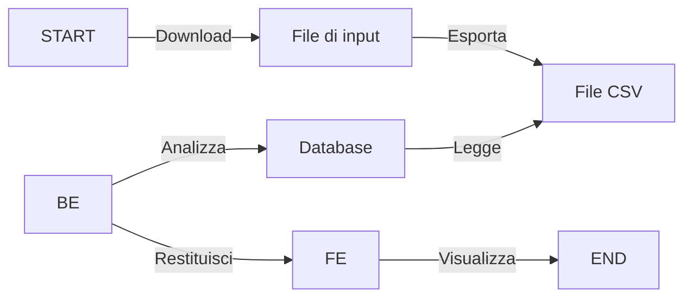

# Esercizio Progetto Ambiente

Utilizzare le risorse web della pagina di [consultazione di dati climatidi della liguria](https://ambientepub.regione.liguria.it/SiraQualMeteo/script/PubAccessoDatiMeteo.asp) per estrarre le informazioni relative ad una stazione meteo.

## Step

1. Download del file manuale
2. Importazione del file in un contenitore `Storage` (Dataframe, SQL, ecc.)
3. BackEnd che carica i dati dallo `Storage` e li restituisce in formato JSON dopo che li ha analizzati. L'analisi comprenderà:
    - Selezione della stazione meteo
    - Selezione della grandezza fisica da voler monitorare (Temperatura, Umidità, Velocità Vento, Precipitazioni, etc.)
    - Selezione del periodo di monitoraggio (giorno, mese, anno)
    - Selezione della frequenza di campionamento (giornaliera, oraria, etc.)
    - Calcolo per ogni grandezza in base al periodo di monitoraggio e alla frequenza di campionamento, di: Max, Min, Media, Deviazione Standard, del periodo di riferimento.

    Il file Json deve essere poi disponibile con un servizio REST API oppure tramite un collegamento diretto tra BE e FE.

4. FrontEnd che consulta il servizio REST/o richiama direttamente il BE, e visualizza i dati in una tabella. Può essere fatto con un framework ASPNET. La pagina web deve essere in grado di visualizzare i dati, scegliendo la grandezza fisica da voler monitorare, mostrando i dati su base mensile. Ogni giorno del mese può essere poi cliccato per visualizzare i dati orari della singola giornata. La pagina web deve essere in grado di visualizzare i dati in un grafico.

## Linguaggi disponmibili

- C#
- Python

# C#

La parte di C# si occuperà della manipolazione del file di input, per formattarlo e generare un file csv conclusivo da poter poi importare nel Database.
